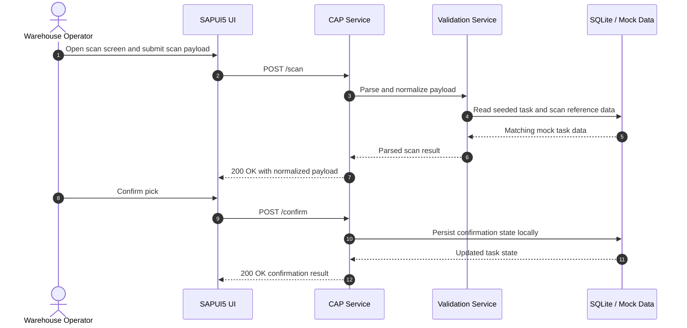
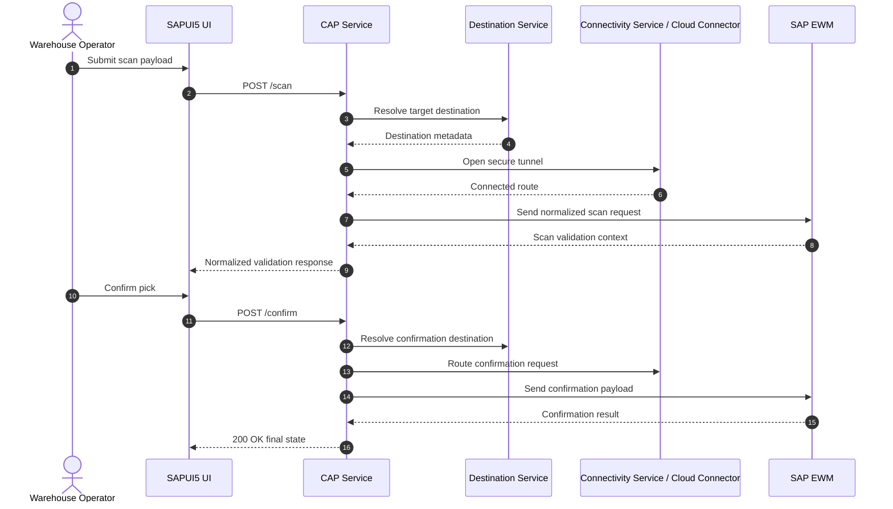
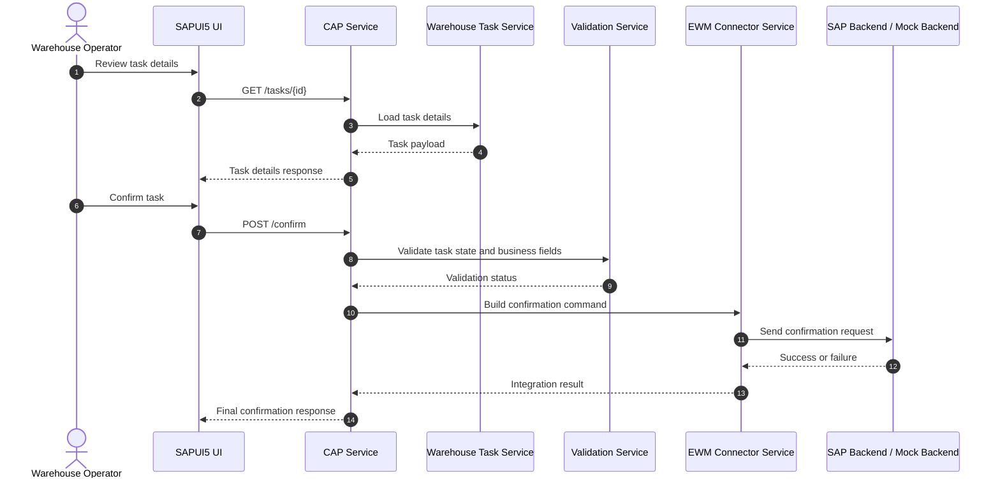

# Sequence Diagrams

## Local Mock Flow

## SAP Production Flow

## Warehouse Task Confirmation Flow

## Diagram Rules
- UI must never call SAP EWM directly.
- CAP remains the single entry point for the frontend.
- Mock and production flows must share the same business contract.